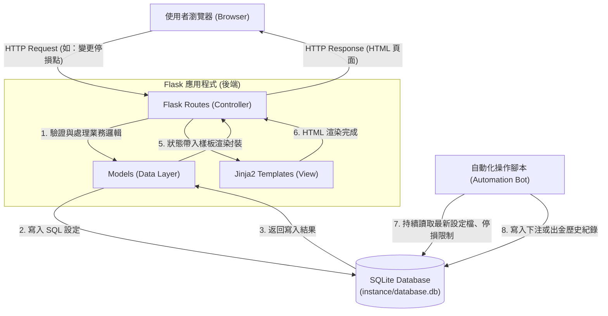

# 系統架構文件 (Architecture) - 賽特選房系統

## 1. 技術架構說明

本專案採用的基礎技術與原因如下：

*   **後端框架：Python + Flask**
    *   **原因**：Flask 輕量、靈活且學習曲線平緩，非常適合快速開發中小型專案。它強大的擴充效能讓未來與自動化腳本或爬蟲工具的整合更加順利。
*   **網頁模板引擎：Jinja2**
    *   **原因**：與 Flask 原生整合，允許我們在 HTML 內直接使用 Python 變數與邏輯（如迴圈產出選房清單）。我們採用伺服器端渲染 (SSR)，不需要分離前後端專案，減少初步開發與部署的複雜度。
*   **資料庫：SQLite**
    *   **原因**：輕量級的關聯式資料庫，無需額外啟動資料庫伺服器，將資料儲存在本地檔案中。這非常適合初期的賽特選房系統保存玩家設定、獲利紀錄與帳號資訊。

### Flask MVC 模式說明

雖然 Flask 本身不強制要求 MVC（Model-View-Controller）模式，但我們將專案結構安排為類似 MVC 的架構以幫助關注點分離：
*   **Model（資料模型）**：負責與 SQLite 溝通，定義如「策略設定」、「交易紀錄」等資料結構與操作邏輯。
*   **View（視圖）**：在此系統由 Jinja2 模板 (Templates) 和靜態資源 (Static) 擔綱，負責將經過處理的資料呈現為直觀的網頁介面。
*   **Controller（控制器）**：由 Flask 的路由 (Routes) 扮演。主要接收網頁前端的請求，呼叫適當的 Model 進行邏輯運算或資料庫讀取，然後將結果傳遞給 View 進行渲染與回應。

---

## 2. 專案資料夾結構

以下為賽特選房系統的資料夾樹狀圖與各部分職責說明：

```text
web_app_development/
├── app/                        # 應用程式主要資料夾
│   ├── __init__.py             # Flask app 實例化與擴充套件初始化
│   ├── models/                 # 資料庫模型 (Model)
│   │   └── database.py         # 定義資料表 Schema 與資料操作邏輯
│   ├── routes/                 # Flask 路由控制器 (Controller)
│   │   ├── main_routes.py      # 主頁與選房儀表板路由
│   │   └── setting_routes.py   # 設定停損、出金等設定介面路由
│   ├── templates/              # Jinja2 HTML 模板 (View)
│   │   ├── base.html           # 全站共用版型 (Header/Footer/Sidebar)
│   │   ├── dashboard.html      # 主頁/總覽畫面
│   │   ├── rooms.html          # 選房介面
│   │   └── settings.html       # 停損與自動化策略設定介面
│   └── static/                 # 靜態資源檔案
│       ├── css/                # 樣式表 (包含全局與動態特效 CSS)
│       ├── js/                 # 前端基本互動邏輯腳本
│       └── images/             # 系統圖示或資源圖片
├── automation/                 # 自動化腳本與爬蟲實作 (不負責 Web)
│   └── bot.py                  # 後台執行自動下注、自動出金的核心引擎
├── instance/                   # 存放不在版控中的本地執行環境檔案
│   └── database.db             # SQLite 資料庫檔案
├── docs/                       # 系統相關文件
│   ├── PRD.md                  # 產品需求文件
│   └── ARCHITECTURE.md         # 系統架構文件
├── requirements.txt            # Python 依賴套件清單 
└── app.py                      # 系統入口檔案，負責啟動 Flask 伺服器
```

---

## 3. 元件關係圖

以下呈現網頁前端、Flask 控制邏輯、資料庫以及自動化腳本間的互動流程：



---

## 4. 關鍵設計決策

1. **獨立背景執行自動化操作程序：**
   * **背景**：Flask 為以 HTTP 請求導向的伺服器，不適合長時間阻擋主執行緒去處理網頁爬蟲或「掛機」遊戲。
   * **決策**：將實際遊戲操作（選房、自動下注、出金偵測）獨立成為 `automation/bot.py`，作為背景進程執行。它與 Flask 分擔職責：Flask 擔任設定和數據展示的門面，系統真正操作引擎在背景運行。雙方透過共享的 SQLite 庫進行無縫溝通（例如：儀表板改設定 >> 寫入 DB >> 背景腳本讀取 DB 套用新參數）。

2. **採用伺服器端渲染 (SSR)：**
   * **背景**：為了快速完成 MVP，減少前端開發門檻。
   * **決策**：不採用 React/Vue，因為會需要額外開發前後端分離的 RESTful 或 GraphQL API。透過 Jinja2 在 Flask 後端直接幫畫面注入清單內容，讓使用者一打開頁面就看到最新的即時參數與選房結果。

3. **路由架構採用拆分 Blueprint 設計（預留擴充）：**
   * **背景**：功能可能在日後增加，會有更多子頁面。
   * **決策**：避免將所有 Route 全部擠在單一 `app.py` 中。設計了 `app/routes/` 根據功能對路由分群管理。這不僅減少專案的耦合度，還提高後續可維護性。

4. **爆分通知機制獨立化預留彈性：**
   * **背景**：系統需在面臨爆分週期時提供通知給玩家。
   * **決策**：初期可能以 Web 上的提示為主，但未來可以輕易讓 `bot.py` 偵測到機會時，直接透過第三方接口（如 Line Notify / Telegram Bot）推播訊息給手持行動裝置的用戶，而不須重新部署整個 Web 架構。
