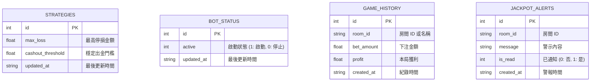

# 資料庫設計文件 (Database Design)

本文件描述賽特選房系統的資料庫結構與 Python Model 實作。

## 1. ER 圖（實體關係圖）

## 2. 資料表詳細說明

### strategies (策略設定表)
儲存使用者的自動化策略參數。
* `id` (INTEGER): 主鍵，預設一筆代表單一使用者設定。
* `max_loss` (REAL): 最高停損金額。
* `cashout_threshold` (REAL): 穩定出金門檻。
* `updated_at` (TEXT): 設定更新時間 (ISO 格式)。

### bot_status (自動化狀態表)
儲存自動化排程程序的狀態。
* `id` (INTEGER): 主鍵，預設一筆。
* `active` (INTEGER): 0 為停止，1 為啟動中。
* `updated_at` (TEXT): 狀態更新時間。

### game_history (遊戲與獲利紀錄表)
紀錄腳本自動操作期間產生的每注紀錄與獲利情形，用於首頁歷史報表。
* `id` (INTEGER): 主鍵。
* `room_id` (TEXT): 操作所在的房間 ID 或名稱。
* `bet_amount` (REAL): 下注金額。
* `profit` (REAL): 本局獲利 (可正可負)。
* `created_at` (TEXT): 紀錄的建立時間。

### jackpot_alerts (爆分預警紀錄表)
當自動化腳本偵測到爆分訊號，寫入此資料表，可供 Web 顯示或觸發 Line 通知。
* `id` (INTEGER): 主鍵。
* `room_id` (TEXT): 機台房間 ID。
* `message` (TEXT): 系統提供的預警提示訊息。
* `is_read` (INTEGER): 是否已經推播給使用者 (0 或 1)。
* `created_at` (TEXT): 預警產生的建立時間。

## 3. SQL 建表語法
實作檔案位於 `database/schema.sql`，並於啟動時建立於 SQLite (例 `instance/database.db`) 中。

## 4. Python Model 程式碼
實作檔案位於 `app/models/database.py`，使用內建 `sqlite3` 進行連線，並實現以下 Model 類別：
* `StrategyModel`: 讀寫使用者的策略參數 (create/get_all/update)。
* `BotStatusModel`: 開啟或關閉背景執行程序旗標。
* `HistoryModel`: 新增並讀取所有獲利歷史列表。
* `JackpotAlertModel`: 新增並讀取即將爆分的機台通知。
