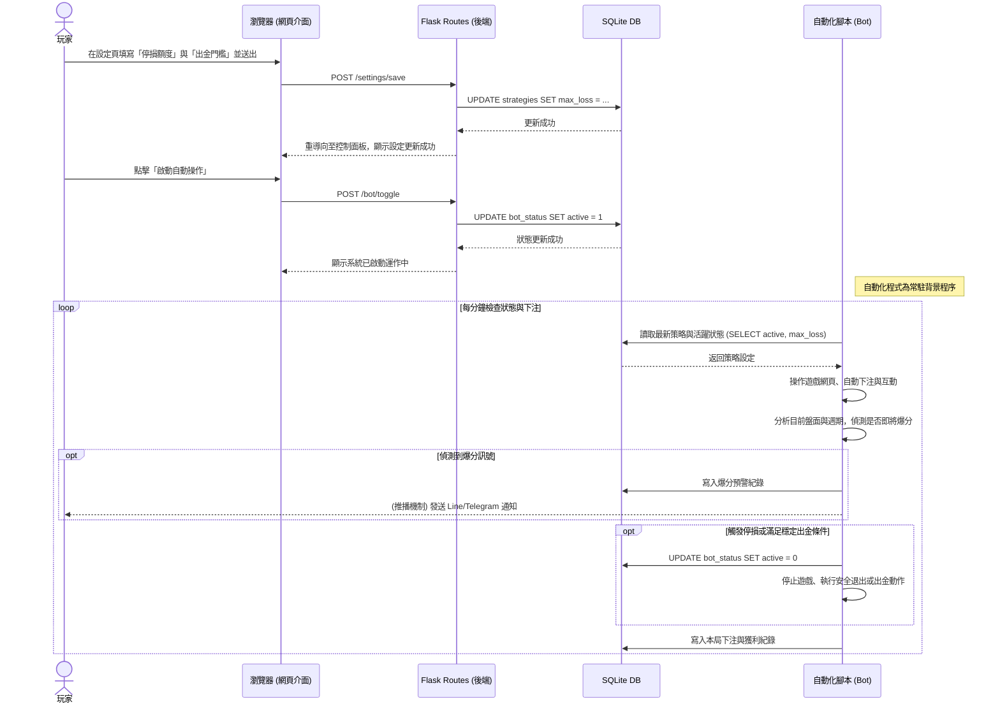

# 流程圖與對照表 (Flowchart) - 賽特選房系統

## 1. 使用者流程圖（User Flow）
此流程圖呈現使用者進入系統後，如何前往各個功能與介面操作的路徑：

```mermaid
flowchart LR
    Start([使用者登入/開啟系統]) --> Dashboard[首頁儀表板<br>(查看歷史獲利)]
    
    Dashboard --> ActionChoice{選擇功能選單}
    
    ActionChoice -->|查看與選房| Rooms[選房介面]
    Rooms -->|1. 系統自動推薦| SelectRoom[進入目標房間]
    
    ActionChoice -->|設定策略| Settings[自動化設定介面]
    Settings -->|2. 設定停損點| SaveStopLoss[儲存停損設定]
    Settings -->|3. 設定穩定出金門檻| SaveCashout[儲存出金設定]
    
    ActionChoice -->|啟動掛機| BotControl[自動操作面板]
    BotControl -->|4. 啟動腳本| BotRunning([自動掛機下注中])
    
    BotRunning -.->|觸發停損/出金達標| AutoStop([系統自動停止])
    BotRunning -.->|5. 偵測即將爆分| Alert([提前推播通知玩家])
```

## 2. 系統序列圖（Sequence Diagram）
這裡描述玩家「設定並啟動自動化掛機」到「系統偵測到狀態並運作」的內部資料流：



## 3. 功能清單對照表
下方列出系統核心功能與對應的 Web 路由端點：

| 功能名稱 | 對應路徑 (URL Path) | HTTP 方法 | 用途說明 |
| :--- | :--- | :--- | :--- |
| 首頁儀表板 | `/` 或 `/dashboard` | `GET` | 查看近期獲利與系統執行狀態 |
| 選房分析介面 | `/rooms` | `GET` | 列出系統篩選後的高勝率房間與週期資料 |
| 前往選房詳細 | `/rooms/<id>` | `GET` | 點擊某房間查看賠率週期詳情 |
| 參數設定介面 | `/settings` | `GET` | 呈現停損與出金設定的表單 |
| 儲存停損與出金 | `/settings/save` | `POST` | 寫入玩家的遊玩策略到資料庫 |
| 啟動/停止自動化 | `/bot/toggle` | `POST` | 更改背景操作腳本的運行狀態 |
| 歷史紀錄查詢 | `/history` | `GET` | 瀏覽每局下注與出金的歷史紀錄表 |
